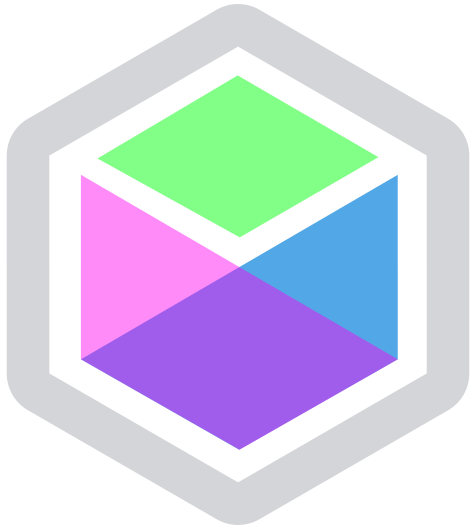

<p align="center"></p>
<h1 align="center">Fun-State</h1>

FunState is a React architecture and library for doing fractal, compositional state in a way that is type-safe,
testable, and easy to refactor.

# Getting Started

FunState works with any react 16.8+ application. Usage without TypeScript works but isn't recommended.

1. `npm install -S fun-state`
2. Pick or create a component to hold the FunState:

```ts
import {index} from 'accessors-ts';
import {useFunState} from 'fun-state';
import {Todo, TodoItem} from './Todo/TodoItem';
...

// Define an interface for your App's state
interface TodoApp {
  users: Todo[]
  ...
}

// Define an initial state:
const initialAppState: TodoApp = {
  todos: [],
  ...
};

// Create a FunState instance within a React.FunctionalComponent (uses react hooks)
const App = () => {
  const state = useFunState(initialAppState);
  const {todos} = funState.get();
  return (
    {/* Child components can get the root state directly */}
    <SelectAll state={state} />
    {todos.map((item, i) => (
      {/* or focus down to the state the component needs to interact with */}
      <TodoItem state={state.prop('todos').focus(index(i))} />
    ))}
  );
};
```

3. Create child components focused on a piece of your state:

```ts
// MyChildComponent.tsx
// Should be imported into the parent state interface
export type ChildState = boolean;

export const MyChildComponent: React.FC<{state: FunState<ChildState>}> = ({state}) => (
  <input type="checkbox" checked={state.get()} onChange=(e => state.set(e.currentTarget.checked))>
);
```

# More examples

See [fun-state-examples](https://github.com/jethrolarson/fun-state-examples) for a sample standalone application.

# When to useFunState

- When you're in a situation where you would gain benefit from redux or other state-managment libraries.
- You want composable/modular state
- You want to gradually try out another state management system without fully converting your app.

# When not to useFunState

- When your data or component heirachy is mostly flat.
- When your app is not as complex as [TodoMVC](https://todomvc.com/).
- You're avoiding `FunctionComponent`s

# Tips

- Keep your FunState Apps simple and delegate the complex logic to pure child components, using `.prop()` where practical.
- Use Accessor composition to drill down into deep parts of your tree or operate on multiple items. See `./TodoApp` or <a href="https://github.com/jethrolarson/accessor-ts">accessor-ts docs</a> for examples.
- If child components need data from multiple places in the state tree, you can create and pass more than one FunState or just pass the root and then query what you need with Accessors.
- Unit test your updaters and snapshot test your components.

# API

## useFunState

```ts
<State>(initialState: State) => FunState<State>
```

Creates an react-hooks based FunState instance with a starting state.

## mockState

```ts
<State>(initialState: State) => FunState<State>
```

Creates a library-agnostic instance of the state machine with a starting state. This is useful when unit testing functions or components that take a FunState instance.

## pureState

```ts
<State>({getState, modState}: StateEngine<State>): FunState<State>
```

Creates an instance of funState given a custom StateEngine. If you want to add support for preact or other libraries with things like hooks you want this.

## Accessor

Used by `FunState:query` and `FunState:focus` for operating on more complex structures. See <a href="https://github.com/jethrolarson/accessor-ts">accessor-ts</a>

## FunState

```ts
export interface FunState<State> {
  get: () => State
  /** Query the state using an accessor */
  query: <A>(acc: Accessor<State, A>) => A[]
  /** Transform the state with the passed function */
  mod: Updater<State>
  /** Replace the state */
  set: (val: State) => void
  /** Create a new FunState focused at the passed accessor */
  focus: <SubState>(acc: Accessor<State, SubState>) => FunState<SubState>
  /** focus state at passed key (sugar over `focus(prop(k))`) */
  prop: <K extends keyof State>(key: K) => FunState<State[K]>
}
```

Data structure that holds the state along with a stateful functions that interact with it.

## merge

```ts
<State>(fs: FunState<State>) => (part: Partial<State>) => void
```

Mutably merge a partial state into a FunState

# TODO / Contributing

- Give feedback!
- Add performance benchmarks
- File bugs
- Improve documentation
- Add more examples
