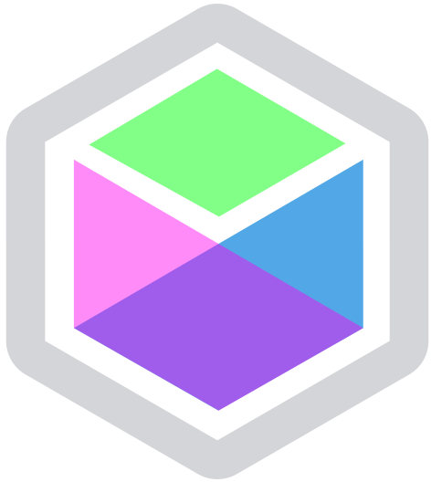

<p align="center"></p>
<h1 align="center">useFunState</h1>

@fun-land/use-fun-state is a React.js hook for doing fractal, compositional state in a way that is type-safe,
testable, and easy to refactor.

# Getting Started

useFunState works with any react 16.8+ application. Usage without TypeScript works but isn't recommended.

### npm

`npm install -S @fun-land/accessor @fun-land/fun-state @fun-land/use-fun-state`

### yarn

`yarn add @fun-land/accessor @fun-land/fun-state @fun-land/use-fun-state`

# Why create another React state-management library?

React's useState hook eliminated a lot of the need to have a state-management solution but I still ran into a number of problems that I didn't like:

1. Too many `useState` calls in my application each of which created two values to manage.
2. I found it difficult to write unit tests for code using useState in a way that felt clean.
3. Using useState was bloating the size of my functional components and it was hard to refactor the functionality out (esentially requiring custom hooks which are themselves hard to unit test.)
4. Having a lot of useState instances meant I had to pass tons of values and callbacks down to child components.

What I wanted:

1. Rather than adding indirection of actions and reducers I wanted to be able to just set the state in event handlers without shame
2. To bundle the concept of setter and current value up so that it can be passed to helper functions as well as child components.
3. Make it easy to drill down into the state and pass subsets of it to functions and child component. It was also important to me that this feature be very sophisticated given the deeply nested data structures I'd worked with.
4. Make it easy to write unit tests for components or functions that use the bundled state without mocking react dependencies.
5. Maintain good type-safety with typescript so the compiler can ensure that everything is copacetic

I looked at many state-management libraries out there and they seemed to have too-much-magic or too-much-boilerplate or both, and still didn't nail all of my goals. I was able to leverage my experience with functional programming and optics to create a pattern that I think is pretty simple while still supporting an enormous number of complex cases. FunState is impure and the types are not quite bullet-proof but it's easy to write most of your code in a testable way and have high confidence that you're not going to have runtime errors.

# Brief Example

```ts
import useFunState from '@fun-land/use-fun-state'

// Type definition for state.
interface CounterState {
  count: number
}

// initial value for the state
const initialCounterState: CounterState = {
  count: 0
}

export const Counter: React.FC = () => {
  // Create the FunState instance wrapping your state
  const state = useFunState(initialCounterState)
  // you can use .prop to focus a child property of a state
  const countState = state.prop('count')
  // Similar to useState you can just set directly (via .set) or apply function to the current value
  const onClick = (): void => countState.mod((count) => count + 1)

  // Extract the current value from the state with .get()
  return <button onClick={onClick}>{countState.get()}</button>
}
```

# More examples

See [fun-state-examples](../fun-state-examples) for a sample standalone application.

# When to useFunState

- You have more than a couple useState calls in a component.
- When you're in a situation where you would gain benefit from redux or other state-managment libraries.
- You want composable/modular state
- You want to gradually try out another state management system without fully converting your app.

# When not to useFunState

- When your data or component heirachy is mostly flat.
- When your app is not as complex as [TodoMVC](https://todomvc.com/).
- You're avoiding `FunctionComponent`s
- You're using a react version older than 16.8

# Tips

- Keep your FunState Apps simple and delegate the complex logic to pure child components, using `.prop()` where practical.
- Use Accessor composition to drill down into deep parts of your tree or operate on multiple items. See `./TodoApp` or [@fun-land/accessor docs](../accessor) for examples.
- If child components need data from multiple places in the state tree, you can create and pass more than one FunState or just pass the root and then query what you need with Accessors.

# API

## useFunState

```ts
<State>(initialState: State, globalMod?: (state: State) => State) => FunState<State>
```

Creates an react-hooks based [FunState](../fun-state)</a> instance with a starting state.

Advanced: `globalMod` is an optional callback that will run on any update to the state. In most cases you shouldn't use it but it can be useful to create implementations of FunState with special caching behavior or effects.

## FunState?

See [@fun-land/fun-state](../fun-state)</a>.

## Accessor?

Used by `FunState:query` and `FunState:focus` for operating on more complex structures. See [@fun-land/accessor](../accessor).
